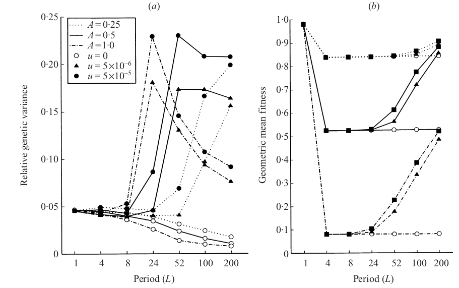

```{r setup, include=FALSE}
knitr::opts_chunk$set(echo = TRUE)
```
# Informations

## Libraries and settings

```{r}
# allow the getActiveDocumentContext() function
library("ggplot2") 

# for nice plots
library("rstudioapi") 

# set the working directory in the active file
setwd(dirname(getActiveDocumentContext()$path)) 
```
# The C++ code and the outputs

The C++ code will do the simulation of the model describe in the article of Burger(2002),
in which he tries to describe the evolution of the diversity depending of the rate of variation in time  of the environment (for more information PUT THE LINKS).

Based on that this code will output the results in two folder (`distr/...` and `stats/...`).

The `distr/...` folder will contains the distribution of each gametes for the last cycle if the environment is non-stochastic and the last 10 cycles if the environment is stochastic. 

The `stats/...` folder will contains the statistical values describe in the article of Burger(2002), respectively:

- the averaged genotypic value
- the averaged genetic variance
- the averaged ratio between the genetic variance and the maximum variance
- the geometric mean fitness

Once a simulation is done, the data will be entered in .csv files whose name are based on the parameters used for the simulation as follow:

- The amplitude of the environment variation times 100 (ex: `a50` for an amplitude of 0.5)
- The period of the environment variation (ex: `L24` for a period of 24 generation)
- The stochastic coefficient times 100 (ex: `d10` for a stochasticity of 0.1)
- The strength of selection (!only integer!, ex:`s5` for a strength of 5)
- The log10 of the mutation rate (!or 0 if null!, ex:`u-5` for a mutation rate of 10^-5)
- The number of loci (ex: `n4` for 4 loci)

Let's open the following files

```{r}
stats <- read.csv("stats/a50_L50_d0_s5_u0_n2.csv",
                  sep = "\t", header = TRUE)
distr <-  read.csv("full_distr/a50_L50_d0_s5_u0_n2.csv",
                   sep = "\t", header = TRUE) 

head(stats)
head(distr)
```
Those tables are organized to be directly readable by ggplot2, maybe less practical when it comes to handle the data in the table (will see later if I change it).

In the first table the `sim_num` corresponds to the number of the simulation (Burger advised to do 4000 per set of parameters), `stat` describe which one of the four observed statistics the row corresponds. And `value` is the corresponding value.

In the second table the `sim_num`is the same as before, `time` corresponds to the number of generations (only from the moment where we keep the values, 1 or 10 cycle(s) before the end), `gamete_num` is the number of the gamete, a value of -1 describe the optimum genotype, `prop` is the proportion of this gamete at this time (or the value of the optimum genotype), and `gamete_value` is the value of this particular gamete.

So 

```{r}
num_loci <- 2
num_gamete <- 2^num_loci
L <- 50
```

```{r}
distr <- distr[(1+(0*((num_gamete+1)*L))):(3*((num_gamete+1)*L)), ]
ggplot(distr, aes(x = time, y = prop*gamete_value, color = gamete_value, group = gamete_num)) + geom_line() + facet_grid(.~sim_num)
distr <-  read.csv("full_distr/a50_L50_d0_s5_u0_n2.csv", sep = "\t", header = TRUE)
```
```{r}
distr <- distr[(1+(0*((num_gamete+1)*L))):(3*((num_gamete+1)*L)), ]
distr$prop[distr$gamete_num >= 0] <- distr$prop[distr$gamete_num >= 0]*num_gamete
ggplot(distr, aes(x = time, y = prop, color = gamete_value, group = gamete_num)) + geom_line() + facet_grid(.~sim_num)
distr <-  read.csv("full_distr/a50_L50_d0_s5_u0_n2.csv", sep = "\t", header = TRUE)

```
```{r}
ggplot(stats, aes(x = stat, y = value)) + geom_boxplot()
```
## Comparison of the results with the Article

To compare the results, we need to get them in the same way than in the article, as follow:



So we see, we will need each time the simulation for a period $L_i$ with $L = \{1, 4, 8, 24, 52, 100, 200\}$.
Aso the default value are as follow
Here is a table of all the simulation that need to be tested (without considering the period so each line corresponds to 8 simulations).

```{r, echo = FALSE}
data.frame("amplitude" = c(0.25, 0.25, 0.25, 0.5, 0.5, 0.5, 1, 1, 1, 0.5, 0.5, 0.5, 0.5, 0.5), "mutation" = c(0, 5*10^(-6), 5*10^(-5), 0, 5*10^(-6), 5*10^(-5), 0, 5*10^(-6), 5*10^(-5), 0, 5*10^(-7), 5*10^(-6), 5*10^(-5), 5*10^(-4)), "stoch" = c(0, 0, 0, 0, 0, 0, 0, 0, 0, 0, 0, 0, 0, 0), "selec_s" = c(5, 5, 5, 5, 5, 5, 5, 5, 5, 5, 5, 5, 5, 5), "n_loci" = c(4, 4, 4, 4, 4, 4, 4, 4, 4, 4, 4, 4, 4, 4))
```
| fig_n | amplitude | mut         | stoch   | n_loci | selec | rec       |
|-------|-----------|-------------|---------|--------|-------|-----------|
| 2     | **0.25**  | **0**       | 0       | 4      | 5     | r         |
| 2     | **0.5**   | **0**       | 0       | 4      | 5     | r         |
| 2     | **1**     | **0**       | 0       | 4      | 5     | r         |
| 2     | **0.25**  | **10^(-6)** | 0       | 4      | 5     | r         |
| 2     | **0.5**   | **10^(-6)** | 0       | 4      | 5     | r         |
| 2     | **1**     | **10^(-6)** | 0       | 4      | 5     | r         |
| 2     | **0.25**  | **10^(-5)** | 0       | 4      | 5     | r         |
| 2     | **0.5**   | **10^(-5)** | 0       | 4      | 5     | r         |
| 2     | **1**     | **10^(-5)** | 0       | 4      | 5     | r         |
| 3     | 0.5       | **0**       | 0       | 4      | 5     | r         |
| 3     | 0.5       | **10^(-7)** | 0       | 4      | 5     | r         |
| 3     | 0.5       | **10^(-6)** | 0       | 4      | 5     | r         |
| 3     | 0.5       | **10^(-5)** | 0       | 4      | 5     | r         |
| 3     | 0.5       | **10^(-4)** | 0       | 4      | 5     | r         |
| 4     | 0.5       | **0**       | 0       | 4      | **1** | **r**     |
| 4     | 0.5       | **10^(-5)** | 0       | 4      | **1** | **r**     |
| 4     | 0.5       | **0**       | 0       | 4      | **5** | **r**     |
| 4     | 0.5       | **10^(-5)** | 0       | 4      | **5** | **r**     |
| 4     | 0.5       | **0**       | 0       | 4      | **5** | **0.005** |
| 4     | 0.5       | **10^(-5)** | 0       | 4      | **5** | **0.005** |
| 5     | 0.5       | **0**       | 0       | **2**  | 5     | r         |
| 5     | 0.5       | **10^(-5)** | 0       | **2**  | 5     | r         |
| 5     | 0.5       | **0**       | 0       | **4**  | 5     | r         |
| 5     | 0.5       | **10^(-5)** | 0       | **4**  | 5     | r         |
| 5     | 0.5       | **0**       | 0       | **6**  | 5     | r         |
| 5     | 0.5       | **10^(-5)** | 0       | **6**  | 5     | r         |
| 6     | 0.5       | **0**       | **0**   | 4      | 5     | r         |
| 6     | 0.5       | **10^(-6)** | **0**   | 4      | 5     | r         |
| 6     | 0.5       | **10^(-5)** | **0**   | 4      | 5     | r         |
| 6     | 0.5       | **10^(-4)** | **0**   | 4      | 5     | r         |
| 6     | 0.5       | **0**       | **0.5** | 4      | 5     | r         |
| 6     | 0.5       | **10^(-6)** | **0.5** | 4      | 5     | r         |
| 6     | 0.5       | **10^(-5)** | **0.5** | 4      | 5     | r         |
| 6     | 0.5       | **10^(-4)** | **0.5** | 4      | 5     | r         |
| 6     | 0.5       | **0**       | **1**   | 4      | 5     | r         |
| 6     | 0.5       | **10^(-6)** | **1**   | 4      | 5     | r         |
| 6     | 0.5       | **10^(-5)** | **1**   | 4      | 5     | r         |
| 6     | 0.5       | **10^(-4)** | **1**   | 4      | 5     | r         |