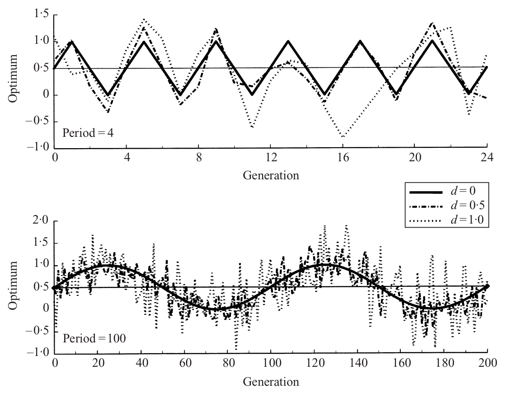
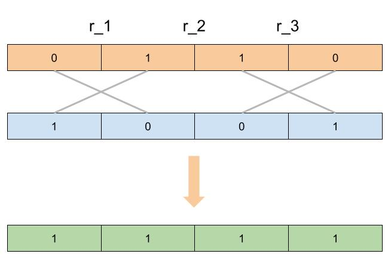
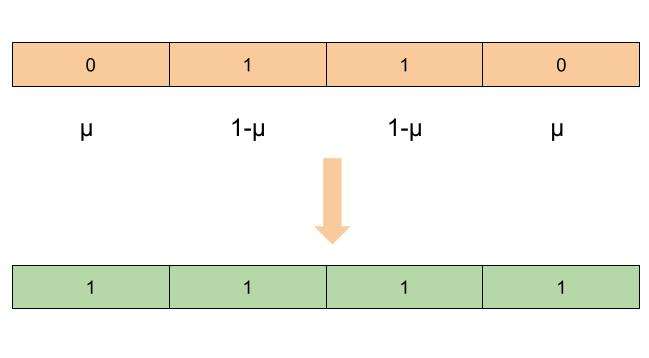

```{r setup, include=FALSE}
knitr::opts_chunk$set(echo = TRUE)
```

# {.tabset}
## The article from Burger (2002)

> The article on which is based this code can be find at [Burger(2002)](https://www.cambridge.org/core/services/aop-cambridge-core/content/view/6AB0F0FA0C6991AAC624A26549D110EC/S0016672302005682a.pdf/div-class-title-fluctuating-environments-and-the-role-of-mutation-in-maintaining-quantitative-genetic-variation-div.pdf).

In summary, This article draft a model to test in which way the effect of the frequency of variation in a varying environment can influence the diversity.

The hypothesis is that if the frequency is too short, then we should expect a few generalist to dominate all the other species, at the opposite, very long variation frequency will allow few species to specialize to the alternate environments. The best in term in diversity would be somewhere between those two extremes where the generalist and specialist would have the same long term fitness.

They described the optimum genotype in time $\theta_t$ as following a sinusoid function of period $L$, amplitude $A$ and with a stochasticity factor $d$ (can be 0).

<p style="text-align:center;">

</p>

Now to describe the population evolving in this environment they consider the corresponding trait as an additive trait, determined by $n$ diallelic loci, each of those loci $i$ can have an allele of value $0$ or an allele of value $\beta_i$ which is sample from an uniform distribution between $0$ and $1$, all those positive alleles are then scaled in a way that the heterozygote would have a value of $0.5$ leading to $\alpha_i = 0.5 \beta_i / \sum_i \beta_i$ the scaled values of the positive alleles.

Also Because all the loci are diallelic, the size of the set of all gametes is $2^n$.

the fitness of an individual can then be calculated as

\[
W_{G,\, t} = \exp(-s(G -\theta_t)^2).
\]

Where $G$ is the genotype (so the sum of a pair of gametes $j$ and $k$) of an individual, $s$ the strength of the selection and $\theta_t$ the optimum genotype at time $t$.

Now we recombination, which they define using a vector of size $n-1$ of rate of recombination and from this vector the function $R_{jk}(i)$ which is the probability to obtain the gamete $i$ from gamete $j$ and $k$.

Above is a figure representing how to consider the recombination in this model.

<p style="text-align:center;">

</p>

So in this particular case the probability considering the blue and orange gamete would be 

\[
R_{jk}(i) = r_1 r_3 (1 - r_2) * 0.5,
\]

It is good to note that we have to consider the probability to not having recombination at the appropriate position.

Also this can be more complex as soon as some loci of $j$ and $k$ are homozygote, since from this point we can either have a recombination or no recombination but we have to consider the two possibilities in the output, for example

<p style="text-align:center;">

</p>
	
In this case we would have 
\[
R_{jk}(i) = [[(1 - r_1)(1 - r_2)(1 - r_3)] + [r_1r_3(1 - r_3)]  + [r_1r_2(1 - r_3)]]*0.5,
\]
with between each square brackets, a way to get $i$ from recombination of $j$ and $k$.

Also this mean that if $i=j=k$ then $R_{jk}(i) = 1$ and if any loci of $i$ is not weared by either $j$ or $k$ then $R_{jk}(i) = 0$.

Mutation occurs with a constant and common mutation rate $\mu$, which makes quite easy the calculation of the probability to go from $j$ to $k$ by mutations.

We can solve the following example

<p style="text-align:center;">

</p>

with the formula 

\[
u_{ij} = \mu^2(1-\mu)^2.
\]

## The model

### The time variation function

The first thing needed is the time fluctuating environment. Burger described the optimal genotype in the environment following a sinus function. To this sinus function will be add stochasticity (sampled in a normal distribution).

So we need 4 parameters:
the ```amplitude``` of the variation,
the ```period``` between two cycles,
the magnitude of the stochasticity parameter (``stoch_magnitude```),
the time to stop the simulation (```t_max```). In the paper this parameter will be 300000 if $d=0$ with the simulation stopping when reaching the equilibrium and 50000 id $d>0$.

We start be initializing those parameters

```{r}
amplitude <- 0.5
period <- 50
stoch_magnitude <- 0.1
t_max <- 200
```

And then describe the function that will generate the optimum genotype fluctuating in time will be

```{r}
get_optimum <- function(t_max, amplitude, period, stoch_magnitude){
  opti_G <- 1:t_max
  opti_G <- lapply(opti_G,
                   function(t) {rnorm(1, 0.5 + amplitude * sin(2*pi*t/period),
                                              stoch_magnitude * amplitude)})
  return(unlist(opti_G))
}
```

leading in our case to a plot like this

```{r, echo = FALSE, out.width="70%", fig.align="center"}
opti_G <- get_optimum(t_max, amplitude, period, stoch_magnitude)
plot(opti_G, type = 'l')
```

When doing a big number of simulations, like 4000 in the article of Burger, we will calculate the next value at each time step rather than the complete timeline, because we can stop the simulation when we reach an equilibrium saving a lot of calculation in many cases.

### Generate the genetics values

We will also need a function that will generate the value of each positive allele, as well as the recombination probabilities. But mostly, what is relevant is to get the description of every possible gametes and their phenotypic values.

So we will describe the following function
```{r}
genetic_sim <- function(num_loci){
  # following codes
  }
```
```{r, include = FALSE}
genetic_sim <- function(num_loci, haploid = F){
  
  nb_gamete <- 2^num_loci
  
  rec_rate <- runif(num_loci-1, 0, 0.5)
  ifelse(haploid, haploid <- 1, haploid <- 0.5)
  loci <- runif(num_loci, 0, 1)
  
  # scale the loci values to get a heterozygote of phenotypic value 0.5.
  loci <- haploid * loci / sum(loci)
  
  # initialize the gamete values and scheme (allelic composition)
  gamete_values <- rep(0, nb_gamete)
  gamete_scheme <- list(rep(0, nb_gamete))
  
  for (i in 1:(nb_gamete)){
    gamete_scheme[[i]] <- num_to_bin(i-1, n = num_loci)
    gamete_values[i] <- sum(loci[as.logical(num_to_bin(i-1, n = num_loci))])
  }
  gamete_distr <- runif(nb_gamete, 0, 1)
  gamete_distr <- gamete_distr / sum(gamete_distr)
  
  return(list(gamete_values, gamete_distr, gamete_scheme, rec_rate))
}
```
So we first start to generate the positive alleles values. Which are sampled from a uniform distribution (btw $0$ and $1$) and then scaled to sum up to $0.5$.

```{r}
# input in the function #
num_loci <- 4 # {
#########################
#beginning of the function

loci <- runif(num_loci, 0, 1)
loci <- 0.5 * loci / sum(loci)
print(loci)
```

From there we can describe every possible gametes. Because the loci are diallelic, the number of possible combinations of alleles will be $2^{n}$.

```{r}
nb_gamete <- 2^num_loci
```
Then considering the positive allele corresponds to a $1$ and the null allele to a $0$, we describe every gamete as a binary value, in fact the binary values from $0$ to the number of gametes will represent every allelic combinations.
In that aim the function ```num_to_bin(i, n)``` will return a vector of size n of the binary of the decimal number $i$.
```{r, include = FALSE}
num_to_bin <- function(number, n) {
  bin_vector <- rev(as.numeric(intToBits(number)))
  if(missing(n)) {
    return(bin_vector)
  } else {
    bin_vector[-(1:(length(bin_vector) - n))]
  }
}
```
```{r}
num_to_bin(6, 5)
```

In the case of every alleles combinations we use

```{r}

gamete_values <- rep(0, nb_gamete)
gamete_scheme <- list(rep(0, nb_gamete))


for (i in 1:(nb_gamete)){
  gamete_scheme[[i]] <- num_to_bin(i-1, n = num_loci)
  print(gamete_scheme[[i]])
  # we then sum up all the allele values that corresponds to a 1
  gamete_values[i] <- sum(loci[as.logical(num_to_bin(i-1, n = num_loci))])
}

```

We then can generate the initial probabilities of gametes which are randomly sampled in a uniform and then scaled to sum up to 1.

```{r}
gamete_distr <- runif(nb_gamete, 0, 1)
gamete_distr <- gamete_distr / sum(gamete_distr)
```

Finally we can generate the recombination rate between two adjacent loci for every pair of adjacent loci as

```{r}
rec_rate <- runif(num_loci-1, 0, 0.5)
# return(list(gamete_values, gamete_distr, gamete_scheme, rec_rate))
# } End of the function
```


### The recombination function

The recombination function is something we really want to calculate once for all before the simulation since its a quite heavy function. We need first a function that will actually perform recombination for two given gametes.

If we want to transform two gametes considering a list of recombination position we can use a recursive function (or ```for()``` loop) to go through all recombination.

```{r}
permut_gamete <- function(j_bin, k_bin, rec_vec){
  
  # Consider the first value of the vector of recombination position
  rec_spot <- rec_vec[1]
  
  # Do the recombination
  j_bin_rec <- c(j_bin[1:rec_spot], k_bin[(rec_spot+1):length(j_bin)])
  k_bin_rec <- c(k_bin[1:rec_spot], j_bin[(rec_spot+1):length(k_bin)])
  
  if (length(rec_vec) > 1) {
    # Recall the function for the next value of the rec_vec
    permut_gamete(j_bin_rec, k_bin_rec, rec_vec[-1])
  } else {
    return(list(j_bin_rec, k_bin_rec))
  }
}
```

Here is an example of the function ```permut_gamete()```

```{r}
permut_gamete(c(1, 0, 0, 1), c(0, 0, 1, 1), c(1, 3))
```


Then we can build the function ```jk_i_recombination(i_bin, j_bin, k_bin, rec_rate)``` that will calculate the probability to get the gamete $i$ considering the gametes $j$ and $k$.

This function will build all the combination of recombination and give them to the ```permut_gamete()``` function. This is what $l$ stand for. The next if else condition will check if their is a recombination. Finally the last two if will check if the new gametes are equal to $i$.

```{r}
jk_i_recombination <- function(i_bin, j_bin, k_bin, rec_rate){
  # ...
}
```
```{r, include = FALSE}
jk_i_recombination <- function(i_bin, j_bin, k_bin, rec_rate){
  R_jk_to_i <- 0
  n <- length(rec_rate)
  l <- rep(list(0:1), n)
  l <- expand.grid(l)
  l <- t((1:(num_loci-1))*t(l))
  for (t in 1:nrow(l)){
    
    rec_vec = l[t, ]

    if (sum(rec_vec)>0){
      rec_vec <- unlist(lapply(rec_vec, function(x) {x[x!=0]}))
      jk <- permut_gamete(j_bin, k_bin, rec_vec)

    } else {
      jk <- list(j_bin, k_bin)
      rec_vec <- -(1:(num_loci-1))
    }
    
    if (all(jk[[1]] == i_bin)){
      R_jk_to_i <- R_jk_to_i + 0.5 * prod(rec_rate[rec_vec]) * prod(1-rec_rate[-rec_vec])
    }
    if (all(jk[[2]] == i_bin)){
      R_jk_to_i <- R_jk_to_i + 0.5 * prod(rec_rate[rec_vec]) * prod(1-rec_rate[-rec_vec])
    }
  } 

  return(R_jk_to_i)
}
```

This chunk will produce a table with every possible combination of recombination, with a $0$ corresponding to no recombination.
```{r}
  R_jk_to_i <- 0

  n <- length(rec_rate)
  l <- rep(list(0:1), n)
  l <- expand.grid(l)
  l <- t((1:(num_loci-1))*t(l))
  l
```
Then, we pass each of this combination in ```permut_gamete()``` 

```{r, eval=F}
for (t in 1:nrow(l)){
    
    rec_vec = l[t, ]

    if (sum(rec_vec)>0){
      rec_vec <- unlist(lapply(rec_vec, function(x) {x[x!=0]}))
      jk <- permut_gamete(j_bin, k_bin, rec_vec)

    } else {
      jk <- list(j_bin, k_bin)
      rec_vec <- -(1:(num_loci-1))
    }
}
```
Each of those permutation is then compare with $i$ using
```{r, eval = FALSE}
    if (all(jk[[1]] == i_bin)){ # compare i with the first permutation
      R_jk_to_i <- R_jk_to_i + 0.5 * prod(rec_rate[rec_vec]) * prod(1-rec_rate[-rec_vec]) # Add the probability that this particular permutation happened based on rec_vec
    }
    if (all(jk[[2]] == i_bin)){ # compare i with the second permutation
      R_jk_to_i <- R_jk_to_i + 0.5 * prod(rec_rate[rec_vec]) * prod(1-rec_rate[-rec_vec])
    }

```

And finally function ```recombination(num_loci, rec_rate)``` is a function that does this for every combination of j, k and i. It will creates a big dataframe and add the probability to have the gamete i considering a pair j and k of gametes, which corresponds to the 3 ```for()``` loops.

```{r, include = FALSE}
recombination <- function(num_loci, rec_rate){
  
  prob_rec <- matrix(0, ncol = 2^num_loci, nrow = 2^(num_loci*2))
  index <- 0
  nb_gamete <- 2^num_loci
  names_cmb <- NULL
  
  for (j in 1:nb_gamete - 1){
    
    j_bin <- num_to_bin(j, num_loci)
    
    for (k in j:(nb_gamete - 1)){
      
      k_bin <- num_to_bin(k, num_loci)
      names_cmb = c(names_cmb, paste(j+1,',',k+1))
      index <- index + 1
      
      for (i in 1:nb_gamete-1){
        
        i_bin <- num_to_bin(i, num_loci)
        prob_rec[index, i+1] <- jk_i_recombination(i_bin, j_bin, k_bin,
                                                   rec_rate)
      }
    }
  }
  
  prob_rec <- prob_rec[1:length(names_cmb), ]
  dtf_rec <- data.frame(t(prob_rec))
  names(dtf_rec) <- names_cmb
  return(dtf_rec)
}
```

```{r}
rec_rate <- runif(2, 0, 0.5)
num_loci <- 3
rec_table <- recombination(num_loci, rec_rate)

print(rec_table[1, 5])
```

### Doing the simulation

So it is a function in 3 steps, first we calculate the mean fitness of your actual population, then you calculate the p_star which corresponds to the eqn 4 in the paper of burger 2002, it will consider the survival rate and the recombination probabilities. Then we add the mutation, and with that the probabilities to go from one gamete to another. Which corresponds to the mutation rate power the number of differences between the two gametes.

```{r, include = FALSE}
new_distributions <- function(num_loci, gamete_distr, gamete_values,
                              gamete_scheme, opti_Gt, dtf_rec, mut_rate){
  nb_gamete <- 2^num_loci
  p_star <- rep(0, nb_gamete)

  mean_fitness <- 0
  
  # Calculate the mean fitness
  for (j in 1:nb_gamete){
    for (k in j:nb_gamete){
      
      mean_fitness <- mean_fitness + exp(-strength_selec *
                      (gamete_values[j] + gamete_values[k] - opti_Gt)^2) *
                      gamete_distr[j] * gamete_distr[k]
      
    }
  }
  
  # Calculate p_star
  for (i in 1:nb_gamete){
    for (j in 1:nb_gamete){
      for (k in j:nb_gamete){
        
        G <- gamete_values[j] + gamete_values[k]
        viability_G <- (exp(-strength_selec * (G - opti_Gt)^2) * gamete_distr[j] * gamete_distr[k] * dtf_rec[i, paste(j,',',k)]) / mean_fitness # change to better data.table
        p_star[i] <- p_star[i] + viability_G
      } 
    }
  }
  
  # Calculate the mutations
  for (i in 1:nb_gamete) {
    
    tot_mut <- 0
    
    for (j in (1:nb_gamete)[-i]){
      mutation_ij <- mut_rate ^ (sum(gamete_scheme[[i]] != gamete_scheme[[j]]))
      tot_mut <- tot_mut + p_star[j]*mutation_ij - p_star[i]*mutation_ij
    }
    
    gamete_distr[i] <- p_star[i] + tot_mut
  }
  return(list(gamete_distr, mean_fitness))
}
```


```{r, out.width="70%", fig.align="center"}

amplitude <- 0.2
period <- 30
stoch_magnitude <- 0.3
strength_selec <- 20
mut_rate <- 5*10^(-4)
num_loci <- 3
t_max <- 200


# One simulation over the t_max period

one_simul <- function(amplitude, period, stoch_magnitude, strength_selec,
                      mut_rate, num_loci, t_max){
  
  initialisation <- genetic_sim(num_loci = num_loci)
  gamete_values <- initialisation[[1]]
  gamete_distr <- initialisation[[2]]
  gamete_scheme <- initialisation [[3]]
  rec_rate <- initialisation[[4]]
  
  dtf_rec <- recombination(num_loci = num_loci, rec_rate = rec_rate)

  opti_G <- get_optimum(t_max = t_max, amplitude = amplitude, period = period, 
                        stoch_magnitude = stoch_magnitude)
  
  distr_over_time <- matrix(0, ncol = length(gamete_distr), nrow = t_max+1)
  distr_over_time[1, ] <- gamete_distr
  mean_fitness_over_time <- rep(0, t_max)
  for (t in 1:t_max){
    opti_Gt <- opti_G[t]
    new_results <- new_distributions(num_loci, distr_over_time[t, ], gamete_values,
                                       gamete_scheme, opti_Gt, dtf_rec, mut_rate)
    distr_over_time[t+1, ] <- new_results[[1]]
    mean_fitness_over_time[t] <- new_results[[2]]
  }
  return(list(distr_over_time[-1,], mean_fitness_over_time, opti_G, gamete_values))
}


simulation <- one_simul(amplitude = amplitude, period = period,
          stoch_magnitude = stoch_magnitude, strength_selec = strength_selec,
          mut_rate = mut_rate, num_loci =  num_loci, t_max =  t_max)


# Test with every combn rather than gametics
value = rep(0, t_max)
for (t in 1:t_max){
  for (j in 1:(2^num_loci)){
    for (k in j:(2^num_loci)){
     value[t] = value[t] + (gamete_values[j]+gamete_values[k]) * simulation[[1]][t, j] * simulation[[1]][t, k] / sum(simulation[[1]][t, ])
    }
  }
}
plot(simulation[[3]], type = 'l')
lines(rowSums(t(t(simulation[[1]])*simulation[[4]]*2)), col = 'red')
lines(value, col = 'blue')

mean_g <- rep(0, t_max)
var_g <- rep(0, t_max)
for (t in 1:t_max){
  for (j in 1:(2^num_loci)){
    mean_g[t] <- mean_g[t] + gamete_values[j] * simulation[[1]][t, j] 
  }
}
for (t in 1:t_max){
  for (j in 1:(2^num_loci)){
    var_g[t] <- (mean_g[t] - (gamete_values[j] * simulation[[1]][t, j]))^2
  }
}

plot(simulation[[3]], type = 'l', ylim = c(0, 1))
lines(var_g*10, col = 'red')

plot(simulation[[3]], ylim = c(0, 1), type = 'l')
lines(simulation[[1]][,1 ], col = 'blue')
lines(simulation[[1]][,2 ], col = 'blue')
lines(simulation[[1]][,3 ], col = 'blue')
lines(simulation[[1]][,4 ], col = 'blue')
lines(simulation[[1]][,5 ], col = 'red')
lines(simulation[[1]][,6 ], col = 'red')
lines(simulation[[1]][,7 ], col = 'red')
lines(simulation[[1]][,8 ], col = 'red')

plot(simulation[[3]], type = 'l', ylim = c(0,1))
lines(simulation[[2]], col = 'blue')

```

## Statistics

> In the article of Burger the results are based on:

* The arithmetic average of the mean genotypic values
```{r, eval = FALSE}
mean_gen <- mean(simul[[1]] * simul[[4]])
``` 

* The arithmetic average of the genetic variances
```{r, eval = FALSE}
mean_gamete <- mean(gamete_values * gamete_distr)
var_gen <- sum((gamete_values*gamete_distr - mean_gamete)^2)
mean_var_gen <- mean(var_gen)
``` 

* The arithmetic average  of the ratios of the genetic variance and the
maximum possible variance in the given genetic system
under linkage equilibrium (V max )
```{r, eval = FALSE}
Vmax <- 0.5 * sum(loci^2)
mean_ratio <- mean(var_gen/Vmax)
``` 


* And the geometric average W F g of population mean fitness.
```{r, eval = FALSE}
geom_mean_fitness <- pow(prod(mean_fitness), 1/length(mean_fitness))
``` 

All this statistics will be put in the following function
```{r, echo = FALSE}
stat_values <- function(gamete_distr, gamete_values, mean_fitness){
  # The code from the last 4 chunks
  return(mean_gen, mean_var_gen, mean_ratio, geom_mean_fitness)
}
```

See the full code by showing the hidden chunk
```{r, class.source = 'fold-hide'}
stat_values <- function(gamete_distr, gamete_values, mean_fitness){
  
  mean_gamete <- mean(gamete_values * gamete_distr) ##!##
  
  var_gen <- sum((gamete_values*gamete_distr - mean_gamete)^2)
  mean_var_gen <- mean(var_gen)
  
  loci <- log(length(gamete_values))/log(2) # To know the num of loci
  Vmax <- 0.5 * sum(loci^2)
  mean_ratio <- mean(var_gen/Vmax)
  
  geom_mean_fitness <- pow(prod(mean_fitness), 1/length(mean_fitness))
  
  return(mean_gen, mean_var_gen, mean_ratio, geom_mean_fitness)
}
```
&nbsp;

&nbsp;

&nbsp;

> Also those values are only kept **at equilibrium**, which is described as:

* In the model **without stochasticity ($d=0$)**, the time when distance between the distributions separated by one cycle is under **$10^{-12}$**, with a maximum of **300 000** generations. 

* In the model with **stochasticity ($d>0$)** the model runs for **50 000** generations and the values of interests are averaged over the **last 10 cycles**.
 
The following code should be inserted in the ```one_simul()``` function instead of using the `t_max` value. 
```{r, eval = FALSE}
# one_simul <- function(amplitude, period, stoch_magnitude, strength_selec,
#                      mut_rate, num_loci){

# ...
  if (stoch_magnitude == 0){
    t_max = 300000
    if ((t%%L == 0) & (L>0)){
      distance = sqrt(sum((distr_over_time[t] - distr_over_time[t-L])^2))
      if (distance < 10^(-12)){
        return(...)
      }
    }
  }

  if (stoch_magnitude > 0){
    t_max = 50000
    return()
  }
# }
```

And the function to get the environmental fluctuations (`get_optimum`)should also be modified to remove the `t_max` variable.

Also only the values at equilibrium should be kept, so in the case of non-stochastic environment, we should only keep the values of the last cycle, and in the case of stochastic environment the last 10 cycles.

```{r, eval = FALSE}
# one_simul <- function(amplitude, period, stoch_magnitude, strength_selec,
#                      mut_rate, num_loci){

# ...
  if (stoch_magnitude == 0){
    # we shrink the matrix from 300000 to L (in our case 24)
    t_max = 300000
   distr_over_time <- matrix(0, ncol = length(gamete_distr), nrow = L)
   current_distr <- gamete_distr
   mean_fitness_over_time <- rep(0, L)
   for (t in 1:t_max){
      opti_Gt <- opti_G[t]
      new_results <- new_distributions(num_loci, current_distr, gamete_values,
                                         gamete_scheme, opti_Gt, dtf_rec, mut_rate)
      
      # We store the result in a different variable for the calcul of the distance
      current_distr <- new_results[[1]]
      #
      # Check the distance
      #
      # Put modulo L instead
      distr_over_time[t%%L, ] <- current_distr
      mean_fitness_over_time[t%%L] <- new_results[[2]]
   }
  }

# WE CAN APPLY THE SAME FOR STOCHATIC BUT WITH (L*10) INSTEAD OF L
```

See the new function by clicking on the `code` button

```{r class.source = 'fold-hide', eval = FALSE}
one_simul <- function(amplitude,
                      period,
                      stoch_magnitude,
                      strength_selec,
                      mut_rate,
                      num_loci, t_max){

  initialisation <- genetic_sim(num_loci = num_loci)
  gamete_values <- initialisation[[1]]
  gamete_distr <- initialisation[[2]]
  gamete_scheme <- initialisation [[3]]
  rec_rate <- initialisation[[4]]
  
  dtf_rec <- recombination(num_loci = num_loci, rec_rate = rec_rate)

  
  
  
  if (stoch_magnitude == 0){
    t_max <- 300000
    opti_G <- get_optimum(t_max = t_max, amplitude = amplitude, period = period, 
                        stoch_magnitude = stoch_magnitude)
    distr_over_time <- matrix(0, ncol = length(gamete_distr), nrow = period)
    current_distr <- gamete_distr
    mean_fitness_over_time <- rep(0, period)
    
    for (t in 1:t_max){
      opti_Gt <- opti_G[t]
      new_results <- new_distributions(num_loci, current_distr, gamete_values,
                                         gamete_scheme, opti_Gt, dtf_rec, mut_rate)

      mean_fitness_over_time[t] <- new_results[[2]]
      current_distr <- new_results[[1]]
      
      if ((t%%L == 0) & (period>0)){
        distance <- sqrt(sum((current_distr - distr_over_time[1, ])^2))
        print(sum((current_distr - distr_over_time[1, ])^2))
        if (distance < 10^(-12)){ ##!##
          return(list(
            distr_over_time,
            mean_fitness_over_time,
            opti_G[t_max - (period:0)],
            gamete_values)
            )
        }
      }
      distr_over_time[t%%period+1, ] <- current_distr
      mean_fitness_over_time[t%%period+1] <- new_results[[2]]
    }
    
  }

  if (stoch_magnitude > 0){
      t_max = 50000
      opti_G <- get_optimum(t_max = t_max, amplitude = amplitude, period = period, 
                        stoch_magnitude = stoch_magnitude)
      distr_over_time <- matrix(0, ncol = length(gamete_distr), nrow = 10*period)
      current_distr <- gamete_distr
      mean_fitness_over_time <- rep(0, 10*period)
      for (t in 1:t_max){
        opti_Gt <- opti_G[t]
        new_results <- new_distributions(num_loci, current_distr, gamete_values,
                                             gamete_scheme, opti_Gt, dtf_rec, mut_rate)
        current_distr <- new_results[[1]]
        distr_over_time[t%%(10*period)+1, ] <- current_distr
        mean_fitness_over_time[t%%(10*period)+1] <- new_results[[2]]
     }
  }
  
  return(list(
    distr_over_time,
    mean_fitness_over_time,
    opti_G[t_max - (length(mean_fitness_over_time):0)],
    gamete_values
    ))
}

simul <- one_simul(amplitude, period, stoch_magnitude, strength_selec, mut_rate, num_loci, t_max)
plot.new()
plot(rowSums(t(t(simul[[1]])*simul[[4]]*2)), ylim = c(0,1))
lines(simul[[3]])
```

&nbsp;

&nbsp;

We can now create a big data.table to keep track of every value

```{r}
# return(list(distr_over_time[-1,], mean_fitness_over_time, opti_G, gamete_values))

data <-data.frame(
  "run" = 1:4000,
  "mean_gen" = rep(0, 4000),
  "gen_var" = rep(0, 4000),
  "V/vmax" = rep(0, 4000),
  "mean_fit" = rep(0, 4000)
)
```

> Then for each simulation we can calculate the values of interest and store them in `data`. 

```{r, eval=FALSE}
for(i in 1:4000){
  simul <- one_simul(amplitude, period, stoch_magnitude, strength_selec, mut_rate, num_loci, t_max)
  gamete_distr <- simul[[1]]
  gamete_values <- simul[[2]]
  mean_fitness <- simul[[3]]
  data[i, ] <- stat_values(gamete_distr, gamete_values, mean_fitness)
}
colMeans(data)
```

But from this point we clearly require optimisation or going to another language, that is why this code has been translated to C++ and not evaluate in this markdown

## Results from the C++ code

